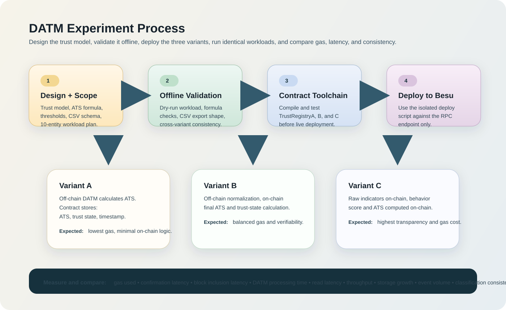

# DATM Besu Experiment Framework

Experimental framework for evaluating three Decentralized Adaptive Trust Manager (DATM) deployment variants on a private Hyperledger Besu network.

This repository is designed to stay logically separate from the main Besu/Kubernetes testbed. It contains the smart contract stubs, offline experiment tooling, dry-run workload generation, CSV export logic, deployment-ready scripts, and design documentation for a research paper workflow.



## Overview

The framework compares three trust-management architectures:

- `Variant A`: off-chain DATM, on-chain storage only
- `Variant B`: off-chain normalization, on-chain final ATS calculation
- `Variant C`: on-chain behavior-score and ATS calculation from raw indicators

The current repository supports:

- shared trust-model and experiment specifications
- deterministic workload and scenario definitions
- Solidity contract stubs for all three variants
- local compile and unit test tooling
- an offline dry-run experiment runner
- deployment-ready contract deployment scripts
- CSV generation for experiment outputs

It does not require Kubernetes access for offline development, and it does not modify the main Besu testbed manifests.

## Experiment Goal

The goal of this framework is to support a controlled comparison of three DATM architectures on the same private Besu environment while keeping the experiment logic isolated from infrastructure management.

The comparison is intended to answer questions such as:

- how much gas each trust-update architecture consumes
- how much logic should remain off-chain versus on-chain
- whether the three variants produce equivalent trust classifications
- how each variant affects latency, event volume, and state growth

## End-To-End Experiment Process

The intended experiment workflow is:

1. Define the trust model, ATS formula, thresholds, workload profiles, and CSV schemas.
2. Validate the formulas and worked examples offline.
3. Compile and test the contract stubs locally.
4. Run the offline dry-run generator to validate workload shape and output formats.
5. Prepare deployment inputs such as `BESU_RPC_URL` and a deployer private key.
6. Deploy `TrustRegistryA`, `TrustRegistryB`, and `TrustRegistryC` to the Besu RPC endpoint.
7. Record the deployed contract addresses.
8. Execute experiment runs against each variant using the same logical workload.
9. Export raw CSV data.
10. Analyze gas, latency, throughput, storage/event growth, and consistency across variants.

This repository currently covers steps `1` through `6` in an implementation-ready form, with offline tooling already available and deployment scripts prepared but not automatically executed.

## Research Scope

The experiment is designed around:

- `10` logical entities
- `4` normal entities
- `3` suspicious entities
- `3` malicious entities
- trust updates every `10` seconds
- default duration of `5` minutes
- `300` logical observations per run

The shared trust model uses:

- `subjectId` as `bytes32`
- ATS range `0..100`
- trust states: `Unknown`, `Trusted`, `Suspicious`, `Untrusted`

Thresholds:

- `Trusted`: `ATS >= 80`
- `Suspicious`: `50 <= ATS < 80`
- `Untrusted`: `ATS < 50`

## What This Folder Is For

This folder is the experiment workspace for the DATM study.

It can be used to:

- document the research design and trust model
- compile and test the variant contracts locally
- generate deterministic workload inputs
- run offline dry-run simulations
- export CSV files in the same structure intended for live runs
- prepare deployment-ready contract artifacts and scripts
- serve as the basis for live Besu-backed measurements later

It is intentionally not the place for:

- Kubernetes manifests
- Helm charts
- validator or RPC node configuration
- genesis management
- cluster operations

## What Will Be Measured

The experiment is designed to measure the following categories.

### On-Chain Cost

- gas used per trust update

### Latency

- transaction confirmation latency
- block inclusion latency
- DATM processing time
- end-to-end trust update latency
- trust registry read latency

### Throughput

- trust updates per second
- trust updates per minute

### Storage And Audit Footprint

- storage growth
- number of on-chain trust-update events

### Correctness And Comparability

- classification consistency across Variant A, Variant B, and Variant C
- ATS deltas across variants for the same logical input

## Experiment Variants

## Repository Layout

```text
contracts/     Solidity contracts for Variant A/B/C and shared types/math
datm/          Shared offline trust formulas
runner/        Offline runners, sample loaders, CSV generation
collectors/    CSV row builders and future collection helpers
analysis/      Validation and post-processing scripts
scenarios/     Sample entities and deterministic sample updates
docs/          Experiment design, schemas, deployment plan, runner plan
artifacts/     Generated local Solidity artifacts
results/       Raw dry-run and sample CSV outputs
scripts/       Deployment-ready scripts
test/          Local unit tests
```

## Current Status

Implemented:

- detailed experiment design documents
- contract interface and scenario specifications
- subject ID mapping rules
- worked examples and CSV examples
- deterministic dry-run experiment runner
- local Hardhat-based contract test workflow
- deployment-ready contract deployment script

Not yet implemented:

- live contract deployment execution in this repo workflow
- live Besu-backed experiment runner
- live transaction measurement collection
- Grafana/Prometheus-integrated analysis in this repo

## Requirements

Local environment used during development:

- Node.js
- npm

Important note:

- The current workspace validated the toolchain on `Node v12.22.9`, but Hardhat prints a compatibility warning because newer Node versions are preferred.
- For a cleaner standalone developer experience, using a modern Node LTS release is recommended when you publish this repo.

## Installation

```bash
npm install
```

This installs the local Solidity compile and test toolchain only for this repository.

## Useful Commands

Compile contracts:

```bash
npm run compile
```

Run unit tests:

```bash
npm test
```

Validate sample scenario formulas:

```bash
npm run validate:samples
```

Generate sample CSV fixtures:

```bash
npm run generate:csv
```

Run the full offline dry-run experiment:

```bash
npm run experiment:dry
```

Prepare contract deployment to a Besu RPC endpoint:

```bash
npm run deploy:contracts
```

Do not run the deployment command unless you explicitly want to send transactions to a live RPC endpoint.

## How To Use This Repository

### 1. Read The Experiment Design

Start with:

- [docs/experiment_spec.md](docs/experiment_spec.md)
- [docs/contracts_interface_spec.md](docs/contracts_interface_spec.md)
- [docs/workload_profile_spec.md](docs/workload_profile_spec.md)
- [docs/scenario_schema.md](docs/scenario_schema.md)
- [docs/metrics_schema.md](docs/metrics_schema.md)

These define the trust model, workload scope, interfaces, and measurement schema.

### 2. Validate The Offline Logic

Use:

```bash
npm run validate:samples
```

This confirms that the shared formulas match the worked examples and sample fixtures.

### 3. Compile And Test The Contracts

Use:

```bash
npm run compile
npm test
```

This verifies:

- Variant A storage behavior
- Variant B ATS calculation and classification
- Variant C behavior-score and ATS calculation
- threshold boundary behavior

### 4. Run The Offline Dry-Run Experiment

Use:

```bash
npm run experiment:dry
```

This generates the full `10`-entity, `30`-round, `300`-observation workload offline and exports dry-run CSV files under `results/raw/`.

### 5. Prepare For Live Deployment

Use:

- `.env.example`
- [docs/deployment_plan.md](docs/deployment_plan.md)
- `npm run deploy:contracts`

Only do this when you intentionally want to deploy to a live Besu RPC endpoint.

## Dry-Run Experiment Output

The dry-run runner exports:

- `results/raw/updates.dry.csv`
- `results/raw/reads.dry.csv`
- `results/raw/events_storage.dry.csv`
- `results/raw/consistency.dry.csv`

These files contain synthetic timing values for offline validation of:

- CSV shape
- workload generation
- cross-variant consistency
- trust-state distributions

They are not live blockchain performance measurements.

## Contract Variants

### Variant A

- contract stores final ATS and trust state
- trust calculation is fully off-chain

### Variant B

- normalized indicators are produced off-chain
- contract computes final ATS and trust state

### Variant C

- raw behavior counters are sent on-chain
- contract computes behavior score, ATS, and trust state

## Deployment Notes

The deployment script:

- reads `BESU_RPC_URL`
- reads `PRIVATE_KEY`
- deploys `TrustRegistryA`, `TrustRegistryB`, and `TrustRegistryC`
- waits for receipts
- writes `results/raw/deployed_contracts.json`

See:

- [docs/deployment_plan.md](docs/deployment_plan.md)

## Key Documentation

- [docs/experiment_spec.md](docs/experiment_spec.md)
- [docs/contracts_interface_spec.md](docs/contracts_interface_spec.md)
- [docs/workload_profile_spec.md](docs/workload_profile_spec.md)
- [docs/scenario_schema.md](docs/scenario_schema.md)
- [docs/metrics_schema.md](docs/metrics_schema.md)
- [docs/runner_plan.md](docs/runner_plan.md)
- [docs/deployment_plan.md](docs/deployment_plan.md)

## Safety Principles

This repository is intended to stay isolated from infrastructure management.

It should not:

- modify Kubernetes manifests
- modify Helm charts
- manage validator keys
- alter genesis configuration
- restart cluster services

The Besu RPC endpoint is treated as an external interface, not as part of repository management logic.

## License

No license file has been added yet.

If you plan to collaborate privately, decide whether you want:

- no public license
- a research-only internal policy
- a standard open-source license for future publication
